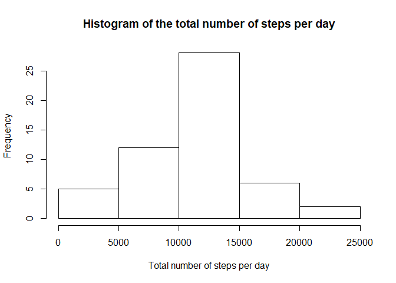
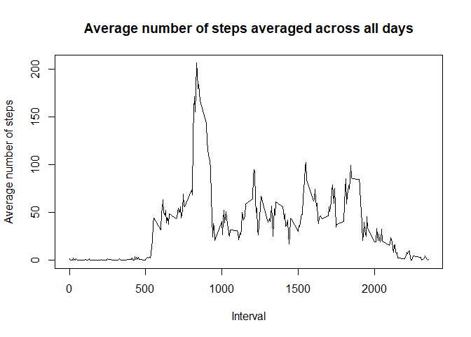
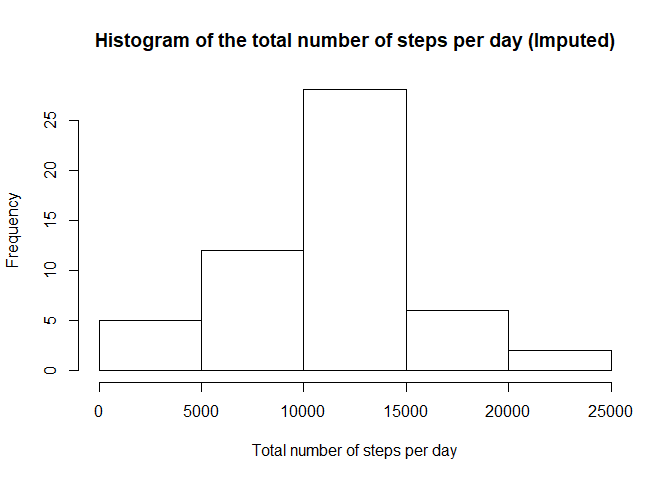
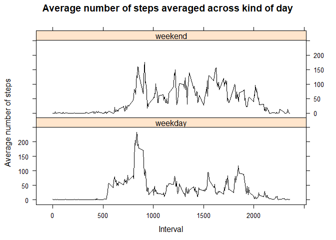

```r
knitr::opts_chunk$set(echo = TRUE)
knitr::opts_chunk$set(warning = FALSE)
knitr::opts_chunk$set(message = FALSE)
options(scipen=999)
```


## Loading and preprocessing the data


```r
activity <- read.csv("activity/activity.csv", header = TRUE, sep = ",")
activitybk <- activity
```


## What is mean total number of steps taken per day?


```r
df2 <- aggregate(steps~date, data=activity, FUN=sum, na.rm=TRUE)
```


```r
hist(df2$steps, main="Histogram of the total number of steps per day", xlab="Total number of steps per day", col="white", border = "black")
```

<!-- -->


```r
media <- round(mean(df2$steps, na.rm = TRUE), 2)
media
```

```
## [1] 10766.19
```

```r
mediana <- median(df2$steps, na.rm = TRUE)
mediana
```

```
## [1] 10765
```

The mean is 10766.19 and the median is 10765.


## What is the average daily activity pattern?


```r
df3 <- aggregate(steps~interval, data=activity, FUN=mean, na.rm=TRUE)
plot(df3$interval, df3$steps, type='l',
     main="Average number of steps averaged across all days",
     xlab="Interval", 
     ylab="Average number of steps")
```

<!-- -->


```r
mans <- max(df3$steps)
mans
```

```
## [1] 206.1698
```

```r
which.max(df3$steps)
```

```
## [1] 104
```

```r
df3[104, ]
```

```
##     interval    steps
## 104      835 206.1698
```

```r
intervalo <- df3$interval[104]
intervalo
```

```
## [1] 835
```

The interval 835 has the maximum average number of steps 206.1698113.


## Imputing missing values


```r
nas <- sum(is.na(activity$steps))
nas
```

```
## [1] 2304
```

The number of rows with NAs is 2304.


```r
for (i in 1:nrow(activitybk)){
  if (is.na(activitybk$steps[i])){
    valorintervalo <- activitybk$interval[i]
    linea <- which(df3$interval == valorintervalo)
    pasos <- df3$steps[linea]
    activitybk$steps[i] <- pasos
  }
}

sum(is.na(activitybk$steps))
```

```
## [1] 0
```


```r
activity2 <- activity
df4 <- aggregate(steps~date, data=activity2, FUN=sum)
hist(df4$steps, main="Histogram of the total number of steps per day (Imputed)", 
     xlab="Total number of steps per day", col= "white",
     border = "black")
```

<!-- -->

```r
media2 <- mean(df4$steps)
media2
```

```
## [1] 10766.19
```

```r
mediana2 <- median(df4$steps)
mediana2
```

```
## [1] 10765
```

```r
summary(df4$steps)
```

```
##    Min. 1st Qu.  Median    Mean 3rd Qu.    Max. 
##      41    8841   10765   10766   13294   21194
```

The mean is 10766.1886792 and the median is 10765.

Do these values differ from the estimates from the first part of the assignment? What is the impact of imputing missing data on the estimates of the total daily number of steps?

Substituting the NA's for the average step value for the interval in the daily total number of steps estimates changes the median and distribution as seen in the histograms. Depending on the method used to fill in the missing values, we can obtain different mean and median values.

## Are there differences in activity patterns between weekdays and weekends?


```r
activity3 <- activity2  
activity3$day <- weekdays(as.Date(activity2$date))
activity3$day[activity3$day == "sábado"] <- "weekend" 
activity3$day[activity3$day == "domingo"] <- "weekend" 
activity3$day[activity3$day == "lunes"] <- "weekday"
activity3$day[activity3$day == "martes"] <- "weekday"
activity3$day[activity3$day == "miércoles"] <- "weekday"
activity3$day[activity3$day == "jueves"] <- "weekday"
activity3$day[activity3$day == "viernes"] <- "weekday"
activity3$day <- factor(activity3$day, levels = c("weekday","weekend"))
```


```r
df5 <- aggregate(steps~interval+day, data=activity3, FUN=mean)
library(lattice)
xyplot(steps ~ interval | day, df5, type = "l", layout = c(1, 2),  
       xlab = "Interval", ylab = "Average number of steps", 
       main="Average number of steps averaged across kind of day", col=c("black", "Black"))
```

<!-- -->


